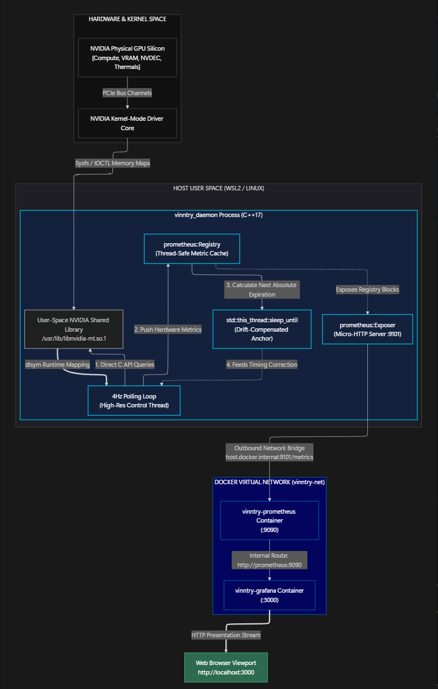
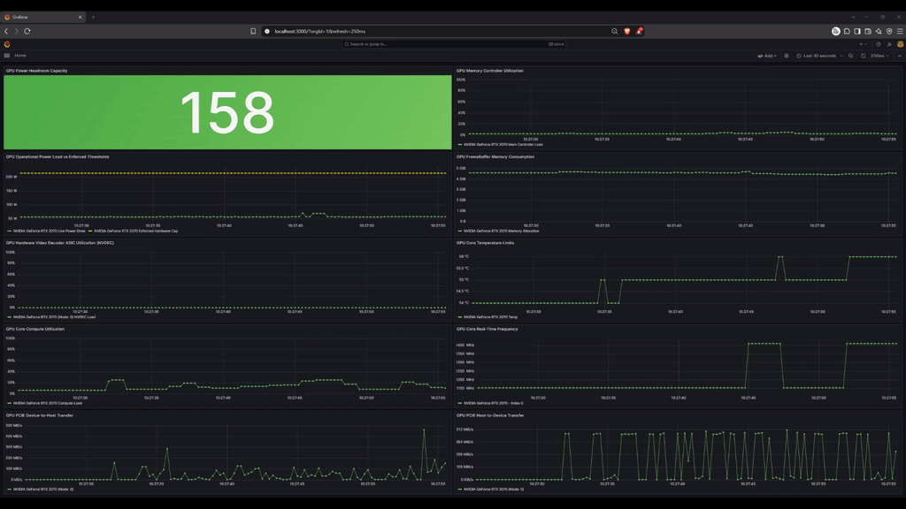
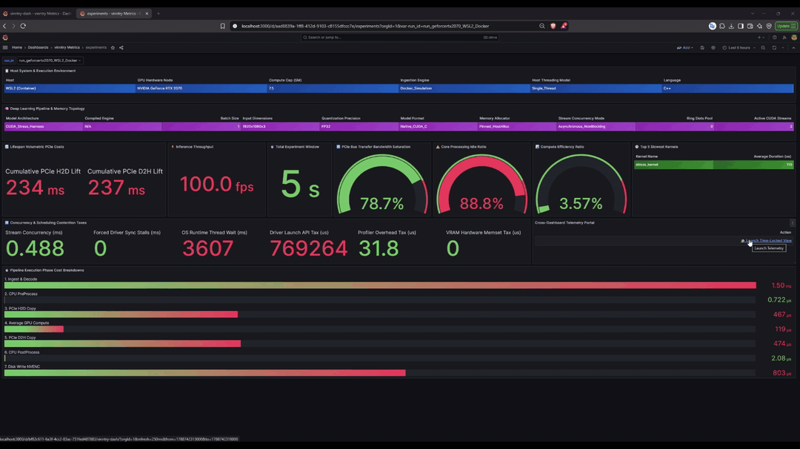
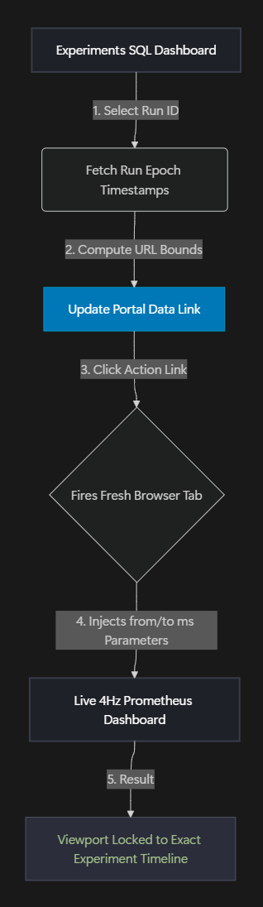

# vinntry-daemon

A high-performance, low-overhead native C++ telemetry daemon designed to profile NVIDIA GPU metrics at microsecond resolution. The system uses runtime dynamic library loading to map and execute `libnvidia-ml.so` symbols, bypassing compile-time hardware dependencies and allowing deployment across native Linux, virtualized environments, and Windows Subsystem for Linux (WSL). 

Collected metrics are exposed via an embedded HTTP endpoint to a Prometheus time-series database running at a high-frequency **4Hz sampling rate (250ms)**, which drives a pre-provisioned Grafana monitoring dashboard.

---

## 🏗️ System Architecture & Data Flow

The application isolates the C++ host process from host compilation dependencies while bridging data cleanly to containerized storage and visualization layers.



---

## 📺 Live Dashboard Performance Preview

The pre-provisioned Grafana viewport is optimized to match the daemon's aggressive 4Hz execution cadence. The animation below demonstrates the microsecond-drift capture loops updating telemetry fields smoothly in real-time under volatile hardware processing loads:



### High-Resolution Panel Layout Highlights
* **Deterministic Refresh Rates:** Visual updates mirror the strict 250ms sampling loop natively, bypassing standard 15-second metric aggregation delays.
* **Transient Spike Capture:** Real-time frequency fluctuations (`MHz`) and core power draw spikes (`mW`) are registered instantly before being smoothed out by time-series averaging.
* **Asynchronous Driver Pipeline:** VRAM consumption tracking vectors update concurrently across independent GPU nodes without causing UI thread stutter or connection dropouts.

---

## 📖 Architecture Terminology & Core Concepts

To maintain a minimal footprint and achieve sub-millisecond precision, this daemon relies on specific low-level systems programming patterns:

* **Runtime Dynamic Library Loading (`dlfcn.h`):** A system API (`dlopen`, `dlsym`, `dlclose`) used to load shared libraries into memory and resolve function pointers at execution time, rather than during compilation. In `src/metric_collector.cpp`, this eliminates the requirement to link against the official NVIDIA CUDA Toolkit headers at compile time. The daemon builds successfully on any standard machine and will only look for the local driver (`libnvidia-ml.so.1`) when it executes.
* **Drift-Compensated Execution Loop:** A timing mechanism that schedules subsequent loops based on absolute future timestamps (`std::chrono::steady_clock`), rather than sleeping for fixed relative durations. Standard relative sleeps (`sleep_for`) suffer from cumulative scheduling drift because the execution time of the code itself adds a tiny delay to each cycle. By tracking absolute target points via `std::this_thread::sleep_until`, the daemon cancels out processing overhead and guarantees a strict, deterministic **4Hz sampling cadence**.
* **Metric Families & Client Registry:** Architectural patterns from the Prometheus telemetry specification where metrics are grouped under a shared base name but isolated via unique key-value descriptor arrays (labels). Instead of instantiating separate tracking objects for every variable, the system registers base `prometheus::Family<prometheus::Gauge>` definitions once. When the system boots, `register_devices()` dynamically forks these families into standalone metric instances assigned explicitly to specific hardware lanes via `device_index` and `gpu_name` metadata tags.
* **Signal Intercept Driver Safeties:** POSIX signal handlers (`std::signal`) configured to intercept operating system runtime kernel faults or termination signals before the application process context completely breaks. If a catastrophic memory fault occurs (`SIGSEGV` or `SIGABRT`), the global atomic pointers inside `src/main.cpp` capture the exception, manually trigger the collector's destructor, invoke the dynamic `nvmlShutdown_` handle, and cleanly unload the driver memory via `dlclose` before yielding control back to the operating system kernel.

---

## 📊 Telemetry Metrics Collected

The native collector maps the following instrumentation points into Prometheus Gauge families, automatically tracking each device index and physical model label:

| Metric String | Unit | Target Context |
| :--- | :--- | :--- |
| `nvml_gpu_util_percent` | % | Core Graphics Compute Utilization |
| `nvml_nvdec_util_percent` | % | Hardware Video Decoder ASIC Load |
| `nvml_mem_util_percent` | % | Integrated Memory Controller Utilization |
| `nvml_fb_mem_bytes` | Bytes | VRAM FrameBuffer Allocated Capacity |
| `nvml_gpu_temp_celsius` | °C | Physical Silicon Core Thermal Readings |
| `nvml_gpu_clock_mhz` | MHz | Real-Time Graphics Engine Clock Frequency |
| `nvml_power_usage_mwatts` | mW | Operational Board Level Power Consumption |
| `nvml_power_limit_mwatts` | mW | Total Enforced Hardware Cap Constraints |
| `nvml_pcie_tx_kbs` | KB/s | PCIe Throughput Host-to-Device |
| `nvml_pcie_rx_kbs` | KB/s | PCIe Throughput Device-to-Host |

---

## 📊 Micro-Architectural Profiling Dashboard

While the high-frequency runtime telemetry pipeline captures transient hardware waves via Prometheus, the **Experiments Dashboard** analyzes bare-metal and container execution boundaries. By extracting processing metrics directly out of archived database (`master.db`), that contains raw Nvidia Nsight Systems traces (`.sqlite`).

### 🖥️ Deep Analysis & Metadata Profiler Dashboard

The **Experiments Dashboard** uses modular, isolated SQL queries to display historical data records via the Grafana SQLite engine. It serves as an audit interface for tracing latency taxes, system constraints, and scheduling bottlenecks.

#### 🎞️ Dashboard Preview



#### 👁️ Interface Architecture Reference Layout
The dashboard uses a compact, high-density layout to maximize data visibility:

*   **Top Footer Tier:** Twin compact data arrays mapping host execution environment variables (Host OS, Docker configs) and Deep Learning variables (Batch scale, input dimensions, model wrappers).
*   **Performance Ribbon:** Processing speeds and systemic hardware arcs (FPS, active workload durations, PCIe interconnect saturation, and compute multipliers).
*   **Contention Tax Grid:** Counters logging thread friction, driver launch penalties, dynamic VRAM zeroing taxes, and operating system scheduling penalties.
*   **Phase Cost Timeline:** A full-width microsecond latency bar gauge mapping every execution block from ingestion to final disk storage.

### ⚡ Micro-Architectural Metric Definitions & Remediation Playbook

#### 1. Hardware Saturation & Global Efficiency
*   **`PCIe Bus Saturation (%)`**: Calculated by mapping achieved throughput speeds over the physical limit of the detected PCIe generation slot width (e.g., **15.75 GB/s ceiling on PCIe Gen3 x16**).
    *   *Remediation:* If this indicator climbs above 85-90%, the interconnect lane is choked. Compress the data pipeline by moving to device-side hardware image decoding (NVDEC) to copy raw compressed bitstreams over the bus instead of massive, uncompressed pixel arrays.
*   **`Silicon Core Processing Idle Ratio (%)`**: Measures the ratio of active math calculation time against total pipeline context duration.
    *   *Remediation:* High values (**>80%**) signal a heavily **I/O Bound** bottleneck. This indicates computing kernels are so fast that the processor sits stalled waiting for slow CPU ingestion loops or memory copies.
*   **`Macro Compute Efficiency Ratio (%)`**: Measures pure compute kernel durations against the absolute execution runtime box of test workload.
    *   *Remediation:* If this number is extremely low, it proves that computing workload is too light for the hardware. You should scale up by expanding batch sizes, stacking multiple models, or swapping toy kernel out for deep-learning inference engines (TensorRT) to saturate the compute grid.

#### 2. Friction & Scheduling Contention Taxes
*   **`Stream Concurrency (ms)`**: The total combined time multiple asynchronous streams (`cudaStreamNonBlocking`) were running code on the SMs at the exact same physical instant.
    *   *Remediation:* Must remain **>0.00 ms** in production multi-stream layouts. If it drops to zero, parallel streams have serialized at the driver layer due to an unintended synchronization bottleneck.
*   **`Forced Driver Sync Stalls (ms)`**: Time wasted by hard, thread-blocking API calls like `cudaStreamSynchronize` or `cudaDeviceSynchronize`.
    *   *Remediation:* Must remain **0.00 ms**. High values prove that a bad architectural call is forcing the entire execution grid to slam on the brakes.
*   **`OS Runtime Thread Wait (ms)`**: Extracted out of the native `OSRT_API` tracking tables. Measures the time the host CPU spent asleep waiting on asynchronous double-buffered ring slots to unlock.
    *   *Remediation:* Exposes resource starvation. If high, CPU thread is out-pacing the GPU queues, proving that you need to widen array of ring buffer memory slots.
*   **`Driver Launch API Tax (us)`**: The raw entry and verification processing duration consumed natively by the NVIDIA driver runtime context while passing execution queues onto the hardware ring buffer.
    *   *Remediation:* If this value balloons while GPU compute time stays microscopic, utilize **CUDA Graphs (`cudaGraphCreate`)** to define execution tree once at initialization, bypassing driver verification logic on every frame launch tick.

### 🛰️ Cross-Dashboard Time-Locked Hyperlink Portal

The profiling dashboard includes an interactive **Time-Locked Navigation Portal** designed to bridge historical database analysis with real-time time-series streams. This will only work if the vinntry daemon was active during experiment(inference) otherwise the time-series data will be missing for that duration and the time-locked dashboard will fail to load.

When an experiment run identifier is selected via the `$run_id` dropdown, the underlying SQLite data handler executes a native cross-join block to isolate the run's exact epoch timestamps:

```sql
SELECT 
    '🛸 Launch Time-Locked View' AS "Action",
    '/d/{<dashboard-id>}/?orgId=1&refresh=250ms&from=' || (start_time * 1000) || '&to=' || (end_time * 1000) AS url_link
FROM experiment_runs 
WHERE run_id = '\$run_id';
```

#### 🔄 The Operational Lifecycle Experience



1. Select target benchmarking sweep from the top control panel filter.
2. The `Cross-Dashboard Telemetry Portal` panel re-compiles its underlying hyperlink data string.
3. Click the blue link cell **`🛸 Launch Time-Locked View`**.
4. Grafana opens a fresh browser tab directly into high-frequency Prometheus live dashboard.
5. The destination page completely bypasses the standard default time window. Instead, **the time selector boundaries are programmatically forced onto the exact start and end milliseconds of that historical hardware stress test**, eliminating manual graph hunting.

---

## 🚀 Getting Started

### Prerequisites
* Linux Environment or **Windows Subsystem for Linux (WSL)**.
* **Mamba** or **Conda** package manager.
* Docker and the Docker Compose plugin.

### 1. Environment Setup & Compilation
The project uses a Conda/Mamba virtual environment to handle toolchain dependencies (`cmake`, `ninja`, and `prometheus-cpp`):

```bash
# Initialize dependency landscape via environment configuration layout
mamba env create -f environment.yml
mamba activate vinntry-env

# Generate native build trees using Ninja build system
cmake -B build -G Ninja -DCMAKE_BUILD_TYPE=Release
cmake --build build
```

### 2. Launching the Infrastructure Stack
To stand up the time-series storage and UI visualization layers, spin up the Docker Compose stack:

```bash
docker compose up -d
```

### 3. Execution
Execute the compiled native binary directly on host engine. It automatically binds an HTTP collector endpoint to port `9101`, allowing the containerized Prometheus instance to query telemetry records directly via the `host-gateway` bridge.

```bash
./build/vinntry_daemon
```

---

## 🛠️ Configuration & Customization

The configuration of the telemetry stack is distributed across three main operational bounds: the C++ Daemon, the Prometheus TSDB Scraping Rate, and the Docker Port Mappings.

### 1. Modifying the C++ Daemon Network Configuration
The native daemon hardcodes the listening endpoint for the Prometheus HTTP scrapper interface inside `src/main.cpp`.

To shift the daemon binding away from default port **`9101`**:
1. Open `src/main.cpp` and locate the initialization of the `prometheus::Exposer` block:
   ```cpp
   prometheus::Exposer exposer{"0.0.0.0:9101"};
   ```
2. Recompile the daemon application utilizing the local build system:
   ```bash
   cmake --build build
   ```

### 2. Tuning Scrape Frequencies & High-Resolution Cadence
The tracking loop features a high-frequency **4Hz framework** across both the native polling code and the containerized collector. If you need to scale down network or storage overhead, you must adjust both locations symmetrically to prevent stale telemetry captures.

#### Adjusting C++ Driver Polling Frequency:
1. Open `src/main.cpp` and locate the timing loop interval variable:
   ```cpp
   const auto interval = std::chrono::milliseconds(250);
   ```

#### Adjusting Prometheus Metrics Extraction Rates:
1. Open `config/prometheus/prometheus.yml`.
2. Modify both the `scrape_interval` and `evaluation_interval` targets to sync with C++ timing offset:
   ```yaml
   global:
     scrape_interval: 250ms
     evaluation_interval: 250ms
   ```
3. Restart or reload the Prometheus storage container engine to parse changes:
   ```bash
   docker compose restart prometheus
   ```

### 3. Adjusting Exposed Infrastructure Network Ports
If ports **`9090`** (Prometheus Workbench) or **`3000`** (Grafana Interface) conflict with existing applications running natively on host environment, modify the exposed routing rules within the composition file.

1. Open `docker-compose.yml` and locate the specific service block mapping.
2. Edit the **left-hand** variable inside the `ports` collection arrays to re-route incoming network transactions (format: `HOST:CONTAINER`):
   ```yaml
   services:
     prometheus:
       ports:
         - "9090:9090"  # Change host side (left) if port 9090 is in use
         
     grafana:
       ports:
         - "3000:3000"  # Change host side (left) if port 3000 is in use
   ```
3. Re-initialize the active container infrastructure matrix:
   ```bash
   docker compose up -d
   ```

---

## 🔒 Storage and Access Controls

* **Grafana Credentials:** Sign-in access is restricted via custom deployment options. Use Username: `admin`, Password: `vinntry_pass`.
* **Dashboard Provisioning:** Dashboards and sources are hot-mounted directly into the target containers. The `vinntry-dash.json` file is enforced via `grafana.ini` as the persistent landing configuration root, meaning monitoring interfaces are instantly accessible without manual UI setup.
